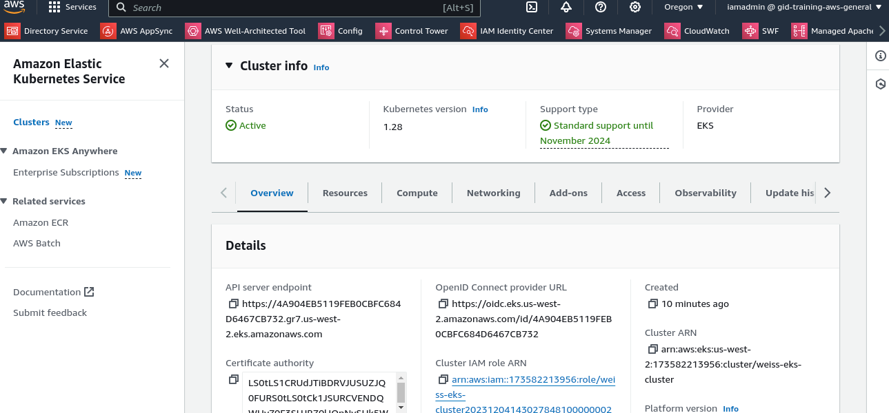

### MyWeb Helm Chart

This Helm chart deploys a Kubernetes Deployment named "myweb" with specific configurations:

# 1. Main Container ('httpd'):

Image: httpd
HTML Documents Path: /usr/local/apache2/htdocs
Resource Requests: CPU - 100m, Memory - 50Mi
Resource Limits: CPU - 200m, Memory - 100Mi

# 2. InitContainer ('generator'):

Image: alpine
Command: echo '<html> Welcome to Kubernetes </html>' > /docroot/index.html
Ensures that index.html is available in the default HTML document path of the 'httpd' container.

# 3. Volume ('docroot'):

Used for file sharing between the main container and the initContainer.

# 4. Expose on Port 80:

The deployment is exposed on port 80.

### Usage

# 1. Helm Chart Deployment

To deploy the Helm chart, use the following command:

helm install myweb-release ./myweb-chart

# 2. GitHub Repository

Commit the resulting Helm chart to this GitHub repository.

# 3. GitHub Actions Workflow

- In the same GitHub repository, a GitHub Actions workflow is configured to:

- Spin up a tiny k3d/k3s cluster.

- Deploy the Helm chart as a release to the cluster.

- Verify that the deployment exposes the "Welcome to Kubernetes" message using curl.

- Exit with an appropriate status code if the message isn't displayed.
Spin down the cluster.

To trigger the workflow, ensure that it's configured for the appropriate events (e.g., push to the main branch).

# Note: Adjust the GitHub Actions workflow file (.github/workflows/deploy.yaml) according to your repository structure.

### Contributing
Feel free to contribute to this project. Create issues for any suggestions or improvements.

### License
This project is licensed under the MIT License.

---

# Running EKS cluster in AWS
The 

# Create GitHub Repo
https://github.com/dvorkinguy/weiss-exercise.git

# Create K8s cluster
I have created in AWS using Terraform

# Download and Install Helm 
https://github.com/helm/helm/releases/tag/v3.13.2
Installed on Linux amd64
Download: wget https://get.helm.sh/helm-v3.13.2-linux-amd64.tar.gz
Extract: tar -xf helm-v3.13.2-linux-amd64.tar.gz
sudo mv helm /bin/

# Create Helm deployment
weiss-chart folder created
templates folder created
maximum variables usage in the deploy and svc yamls

